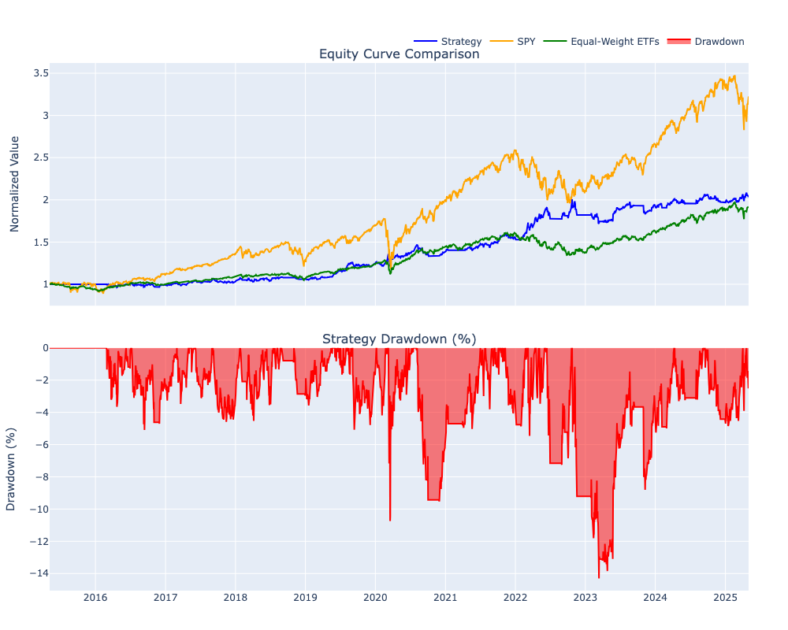

# Systematic Low-Correlation ETF Trend Strategy

This repository contains a proof-of-concept implementation of a systematic ETF trend-following strategy originally shared by [@quant_kurtis on Twitter](https://x.com/quant_kurtis/status/1917933362897142179). The strategy is designed to complement traditional passive ETF allocations by identifying and trading ETFs with strong trends and low correlation to the S&P 500.

## Strategy Overview

The strategy employs a systematic approach to select 2-3 ETFs from a diverse universe based on:
1. Trend following signals using moving averages
2. Correlation analysis with S&P 500
3. Position drift management with tolerance bands

### Historical Performance (1999-Present) (according to @quant_kurtis)
```
- CAGR: 10.10%
- Turnover: 117.72%
- Maximum Drawdown: -19.61%
- Sharpe Ratio: 0.74
- Correlation to S&P 500: 0.04
```

### Backtested Performance (2015-Present)
This implementation focuses on recent market conditions, starting from 2015, to provide a realistic assessment of the strategy's performance in modern markets. This timeframe captures diverse market environments while avoiding look-ahead bias that can occur when backtesting over extended historical periods.



```
Strategy Performance Metrics:
  CAGR: 7.39%
  Max Drawdown: 14.31%
  Sharpe Ratio: 0.81
  Peak: 2025-04-21 00:00:00
  Trough: 2023-03-13 00:00:00

SPY Benchmark:
  CAGR: 12.4%
  Max Drawdown: 33.7%
  Sharpe Ratio: 0.73

Equal-Weighted ETF Portfolio Metrics:
  CAGR: 6.74%
  Max Drawdown: 16.67%
  Sharpe Ratio: 0.82
```

## ETF Universe

The strategy trades the following ETFs:
- TLT (20+ Year Treasury Bonds)
- TBF (Short 20+ Year Treasury Bonds)
- DBC (Commodities)
- IEF (7-10 Year Treasury Bonds)
- GLD (Gold)
- QQQ (Nasdaq 100)
- HYG (High Yield Corporate Bonds)

## Core Strategy Rules

### Entry Criteria
1. Close price above 50-day moving average
2. 50-day moving average above 200-day moving average
3. Select 2-3 ETFs with lowest 26-week correlation to S&P 500

### Exit Criteria
- Close price below 200-day moving average
- OR 50-day moving average falls below 200-day moving average

### Position Management
- Equal weight between positions
- Scale up to 100% in single ETF when appropriate
- Allow position drift within tolerance bands
- Minimal rebalancing to reduce turnover

## Repository Structure

- `backtester.py`: Main backtesting engine implementation
- `data_fetcher.py`: Handles data acquisition for ETFs
- `indicators.py`: Technical indicator calculations
- `test_strategy.py`: Strategy testing and validation
- `backtest_analysis.ipynb`: Jupyter notebook for analysis and visualization
- `requirements.txt`: Python dependencies

## Getting Started

1. Clone the repository
```bash
git clone https://github.com/yourusername/Systematic-Low-Correlation-ETF-Trend-Strategy.git
```

2. Install dependencies
```bash
pip install -r requirements.txt
```

3. Run the data fetcher and initialize the indicator values
```bash
python data_fetcher.py && python indicators.py
```

4. Run the backtester or open the Jupyter notebook
```bash
python backtester.py
```
```bash
jupyter notebook backtest_analysis.ipynb
```

5. Run test_strategy.py
```bash
python test_strategy.py
```
This will output the actual trades that need to happen, when run.

## Disclaimer

This is a proof-of-concept implementation meant to demonstrate the strategy's mechanics and potential. It is not financial advice. The original strategy was designed and tested on Portfolio123's platform, and this implementation may have variations in results due to differences in data sources, execution assumptions, and implementation details.

Always conduct your own research and consider consulting with financial professionals before implementing any trading strategy.

## Credits

Original strategy by [@quant_kurtis on Twitter](https://x.com/quant_kurtis/status/1917933362897142179).

## License

This project is licensed under the MIT License - see the LICENSE file for details.